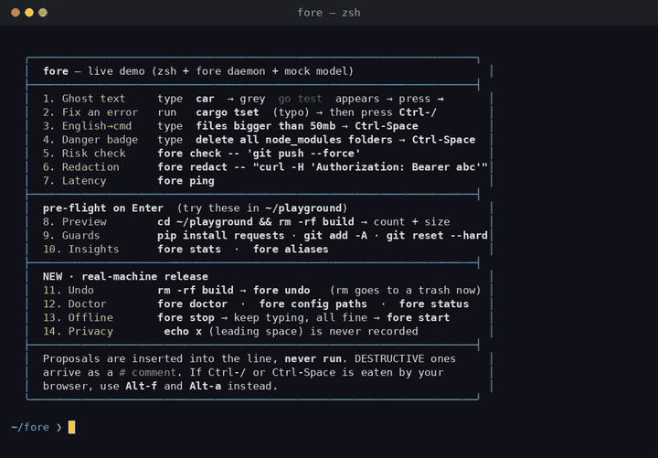
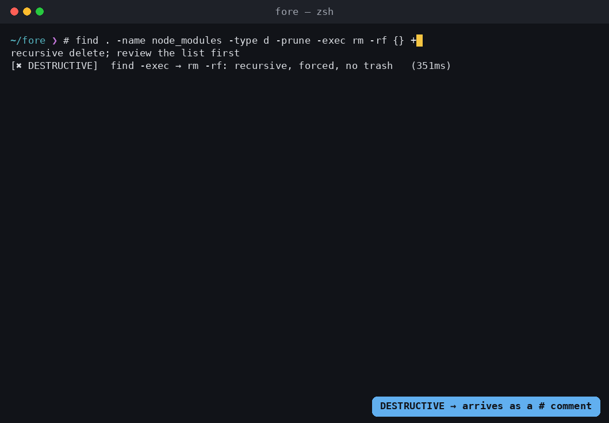
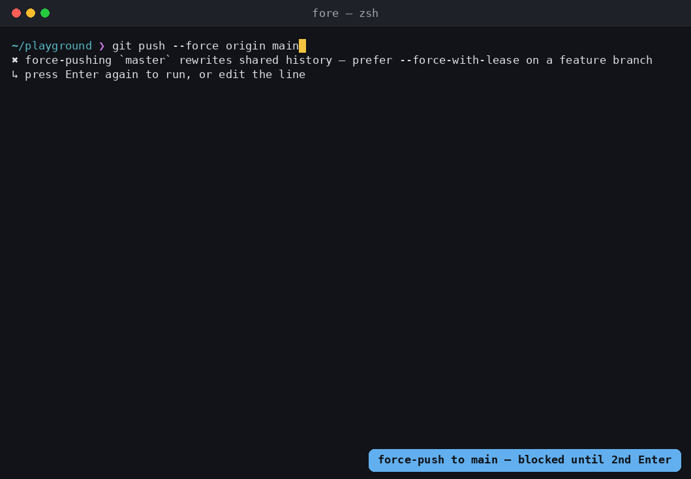
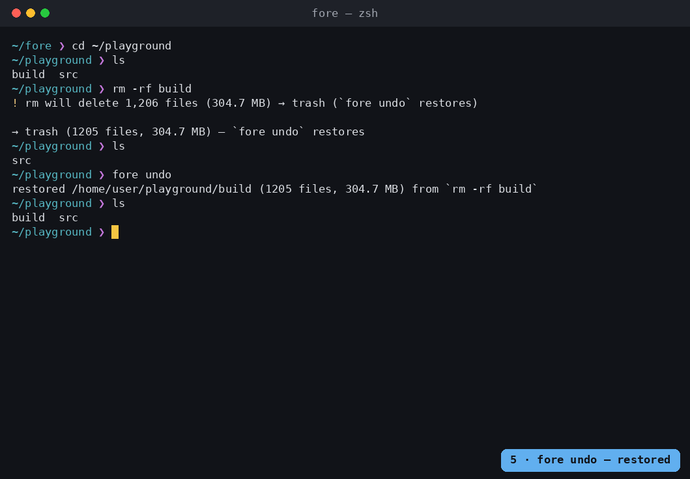
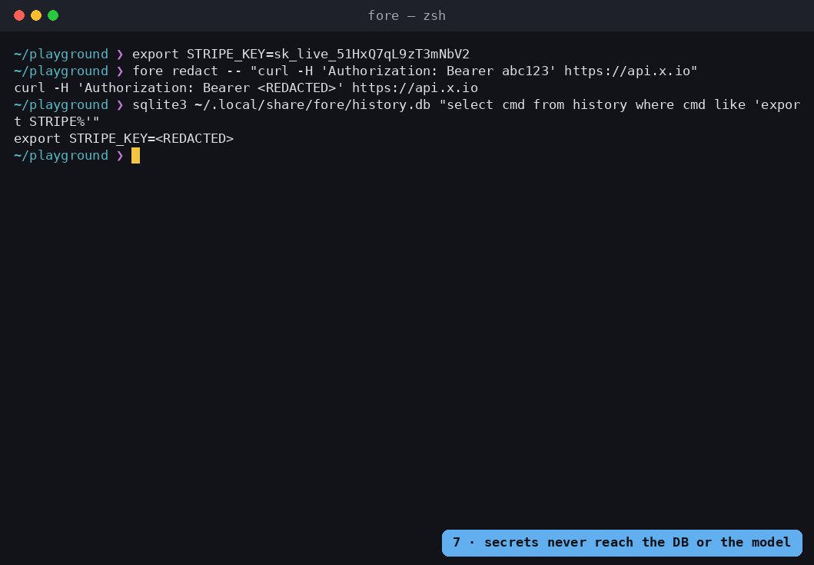
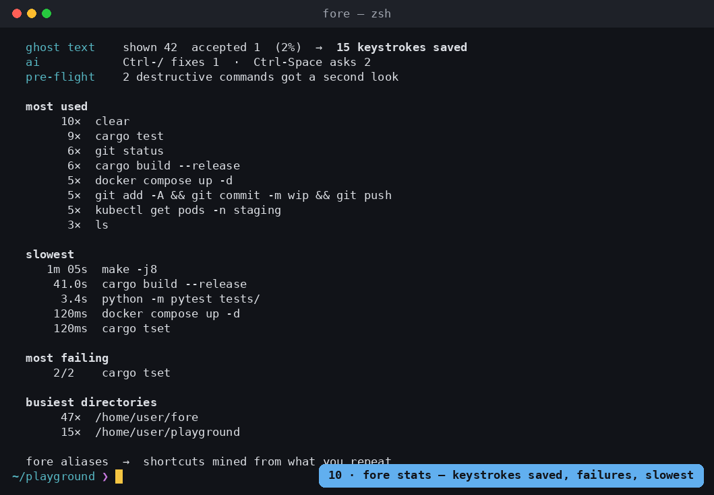

<h1 align="center">Fore</h1>

<p align="center">
  <b>A local-first shell copilot for the terminal you already use.</b><br>
  Ghost-text from <i>your</i> history · <code>Ctrl-/</code> fixes the last failed command · <code>Ctrl-Space</code> turns English into a command ·<br>
  pre-flight checks before Enter · <code>rm</code> you can undo · secrets never leave the machine.
</p>

<p align="center">
  <a href="https://github.com/YOUR_GITHUB_USER/fore/actions/workflows/ci.yml"></a>
  
  
  <a href="LICENSE"></a>
  
  
</p>

<p align="center">
  
</p>

---

**fore is not a terminal and not a new shell.** It's a zsh plugin plus a tiny Rust daemon.
Keep iTerm/Ghostty/Kitty/Alacritty/Terminal.app/Windows Terminal, keep your prompt, keep
zsh-autosuggestions — fore sits underneath and stays out of the way.

```
you type ──► zsh + fore.zsh (observe, paint ghost text, keybindings)
                  │  JSON over a Unix socket, ~0.1 ms
                  ▼
             fore daemon (Rust, ~4 MB RSS) ── SQLite history ── in-memory predictor
                  │  only for Ctrl-/ and Ctrl-Space, only redacted text
                  ▼
             any OpenAI-compatible model: Ollama (local, default) · OpenAI · Claude · Gemini · Groq · …
```

## What you get

| | | |
|---|---|---|
| **Ghost text** | Type `car` → `cargo test` appears in grey, learned from what *you* run in *this* directory. `→` accepts. No model involved; 1.8 ms p99. | |
| **`Ctrl-/` fix it** | A command failed? The diagnosis was already computed while you were reading the error. Press `Ctrl-/`: one-line *why* + the fix placed in your line editor, with a risk badge. |  |
| **`Ctrl-Space` English → command** | Type `files bigger than 50mb`, press `Ctrl-Space`, get `find . -type f -size +50M …`. Destructive proposals are inserted as a `# comment` so a reflexive Enter does nothing. |  |
| **Pre-flight on Enter** | `rm -rf build` → *"will delete 1,206 files (304.7 MB)"*. `git push --force origin main` → blocked until you press Enter again. `git add -A` with a `.env` in the tree → warned. Runs in ~2 ms; never delays Enter more than 400 ms. |  |
| **Undo** | `rm` goes to a trash with a journal. `fore undo` puts it back where it was. `command rm` when you mean it. |  |
| **Privacy by construction** | Secrets are masked *before* they touch the history DB, and the model client's input type can only be constructed by the redactor. `fore redact 'curl -H "Authorization: Bearer sk_live_…"'` shows exactly what would leave. |  |
| **Insights** | `fore stats`: failure rate, time spent waiting, keystrokes saved, slowest commands. `fore aliases`: shortcuts mined from what you actually repeat. |  |

Everything except `Ctrl-/` and `Ctrl-Space` works with no model at all. When the model is down, the
AI features pause themselves (circuit breaker) and answer in milliseconds instead of hanging.

## Install

Requires **zsh** (macOS default; `chsh -s $(command -v zsh)` on Linux) and a Rust toolchain
(`install.sh` offers to install one). macOS, Linux and WSL2. First build takes 1–3 minutes.

```sh
git clone https://github.com/YOUR_GITHUB_USER/fore && cd fore
./install.sh     # builds → ~/.local/bin/fore, adds one line to ~/.zshrc,
                 # sets up autostart (launchd/systemd), imports your existing history, runs `fore doctor`
```

Open a new terminal. Type the beginning of something you've run before → grey ghost text.

<details>
<summary>Manual install / uninstall / what install.sh touches</summary>

```sh
cargo build --release
install -m755 target/release/fore ~/.local/bin/
echo 'eval "$(fore init zsh)"' >> ~/.zshrc     # the plugin auto-starts the daemon on demand
fore install --no-service                      # optional: config template + history import + doctor

./install.sh --uninstall          # removes autostart, the ~/.zshrc line, the binary; keeps history
./install.sh --uninstall --purge  # …and history, trash, config, logs
```

`install.sh` adds exactly this block to `~/.zshrc` (or `$ZDOTDIR/.zshrc`):

```sh
# fore — shell copilot (https://github.com/YOUR_GITHUB_USER/fore)
export PATH="$HOME/.local/bin:$PATH"
command -v fore >/dev/null 2>&1 && eval "$(fore init zsh)"
```
</details>

## Connect an AI model

fore talks the OpenAI `/chat/completions` dialect, which every provider now exposes — so
"connecting a model" is one command. The default is **Ollama, local and free**; nothing leaves
your machine.

```sh
# local (default) — free, private, works offline
brew install ollama            # or: curl -fsSL https://ollama.com/install.sh | sh
ollama pull qwen2.5-coder:1.5b # ~1 GB, answers in ~1 s on a laptop
fore model                     # ✔ server reachable, model available

# or any cloud provider — asks for the key (hidden), stores it 0600, restarts the daemon
fore model use groq            # free tier, very fast
fore model use gemini          # free tier
fore model use github          # free with a GitHub account (fine-grained PAT, `models` permission)
fore model use openai --model gpt-4.1-mini
fore model use anthropic       # claude-haiku-4-5 via Anthropic's OpenAI-compatible layer
fore model use openrouter --model qwen/qwen-2.5-coder-32b-instruct

# anything else that speaks the OpenAI API (LM Studio, llama.cpp, vLLM, a corporate gateway…)
fore model use custom --url http://gpu-box:8000/v1 --model my-model [--key …]

fore model test "show listening ports"   # one real round trip, through the daemon, redaction included
fore model list                          # every preset with its default model
```

| preset | default model | cost |
|---|---|---|
| `ollama` `lmstudio` `llamacpp` `vllm` | `qwen2.5-coder:1.5b` … | free, local |
| `groq` | `llama-3.3-70b-versatile` | free tier |
| `gemini` | `gemini-2.5-flash` | free tier |
| `github` | `openai/gpt-4.1-mini` | free with GitHub account |
| `openai` | `gpt-4.1-mini` | paid |
| `anthropic` | `claude-haiku-4-5` | paid |
| `openrouter` `mistral` `deepseek` `together` | see `fore model list` | cheap |

Keys go in `~/.config/fore/api_key` (mode 600), or the provider's usual env var
(`OPENAI_API_KEY`, `GROQ_API_KEY`, `GITHUB_TOKEN`, …) is picked up automatically. `fore config show`
never prints the key. Cloud providers only ever receive **redacted** text — `fore redact …` shows
precisely what; `tools/mock_llm.py` logs every prompt if you want to audit the daemon itself.

## Keys and commands

| key | does |
|---|---|
| `→` `End` `Ctrl-E` | accept ghost text |
| `Ctrl-/` (or `Alt-f`) | why did the last command fail + the fix, placed in the line editor |
| `Ctrl-Space` (or `Alt-a`) | translate the plain-English line into a command |
| `Enter` | pre-flight; a `✖ block` needs a second Enter on the unchanged line |

Proposals are **never executed** — they are inserted for you to read.

```sh
fore doctor                # why isn't it working? ✔/!/✖ per check, each with a one-line fix
fore model [use|test|key]  # which AI model, switch, verify
fore stats                 # the feedback loop
fore aliases [--install]   # shortcuts mined from your history
fore undo · fore trash list|purge
fore start|stop|restart|status
fore config init|edit|show|paths
fore import                # seed from ~/.zsh_history / ~/.bash_history (redacted, idempotent)
fore check 'rm -rf /tmp/x' # risk-classify a command offline (exit code 0–3 = severity)
fore redact 'export TOKEN=abc123'
```

<details>
<summary>Pre-flight: what it checks</summary>

Every Enter goes through the daemon first (~2 ms). Findings print above the command:

```
$ rm -rf build
✖ rm will delete 1,206 files (304.7 MB)
↳ press Enter again to run, or edit the line
```

| severity | behaviour |
|---|---|
| `·` info | printed, runs |
| `!` warn | printed, runs |
| `✖` block | printed, **not run** — press Enter again on the unchanged line to confirm; any edit resets |

Checks: `rm` / `find -delete` / `rsync --delete` previews with real counts · `>` truncating an
existing file · `git reset --hard` / `clean` / `checkout --` / `branch -D` previews · pip outside a
venv · `sudo pip` · mixed package managers · kubectl/helm/terraform/aws against a prod context ·
force-push to a protected branch · staging `.env`/key files · `chmod 777` · `docker system prune -a`
· repeated-failure streaks · typical duration ("usually takes ~2 m").

Daemon down or slow? Enter behaves normally. `FORE_PREFLIGHT=0` disables it; `FORE_IGNORE=venv,prod`
or `[preflight].ignore` silences specific checks.
</details>

<details>
<summary>Undo: how safe rm works</summary>

The plugin aliases `rm` to `fore rm`, which understands rm's flags (`-r -f -v -d --`), moves the
targets into `~/.local/share/fore/trash/<op>/` and writes a journal. Same exit codes and messages as
rm, so scripts and muscle memory are unaffected.

```sh
rm -rf build             # → trash — `fore undo` restores
fore undo                # puts it back (won't clobber a newer file of the same name)
fore trash list          # every restorable operation, newest first
fore trash purge         # drop entries older than [undo].keep_days (14); the daemon does this on start
command rm file          # or \rm — the real rm
```

Refuses `/`, `$HOME`, `/usr`, `/etc`, `/var` outright. Deletes over `[undo].max_bytes` (2 GB) tell
you to use `command rm`. Cross-filesystem moves copy+delete, still reversible. `FORE_SAFE_RM=0` or
`[undo].safe_rm = false` turns it off.
</details>

<details>
<summary>Configuration and file locations</summary>

`~/.config/fore/config.toml` — `fore config init` writes a fully commented template, `fore config
edit` opens it, `fore config show` prints the effective merge. Env vars override the file:
`FORE_LLM_BASE_URL` `FORE_LLM_MODEL` `FORE_LLM_API_KEY` `FORE_PREFLIGHT=0` `FORE_IGNORE=a,b`
`FORE_SAFE_RM=0`.

Sections: `[llm]` endpoint, key file, timeout, circuit breaker · `[preflight]` ignore list,
protected branches, prod markers, block thresholds · `[history]` ignore-space, ignore prefixes,
redact-on-write · `[undo]` safe rm, retention, max size · `[ui]` ghost style, `→` binding.

`fore config paths`: config `~/.config/fore/` · history + trash `~/.local/share/fore/` · log +
socket + pid `~/.local/state/fore/` (socket in `$XDG_RUNTIME_DIR/fore/` when available) · service
`~/Library/LaunchAgents/dev.fore.daemon.plist` or `~/.config/systemd/user/fore.service`.
</details>

<details>
<summary>Privacy and offline behaviour</summary>

- Commands are redacted **before** they're written to the history DB, so `export TOKEN=abc…` is
  stored as `export TOKEN=<REDACTED>`. Three layers: known key formats (AWS, Stripe, GitHub, Slack,
  JWT, private keys…), `KEY=value` / `--password value` / `Authorization:` shapes, and high-entropy
  tokens.
- A leading space means "don't record" — same convention as `HIST_IGNORE_SPACE`; the plugin
  doesn't even send it to the socket.
- The model client's input type (`Redacted`) has a private constructor that only the redactor can
  call. Forgetting to redact is a compile error, not a code-review item.
- Ghost text, pre-flight, undo, stats and aliases never contact a model. When the endpoint is down
  the daemon stops trying after `[llm].circuit_failures` consecutive errors and `Ctrl-/` answers in
  ~3 ms with *"model unreachable — AI paused for 118 s"*; it retries after the cooldown. If the
  daemon itself is down, the plugin degrades to a normal shell and restarts it on the next shell
  start.
</details>

## Performance

Measured on the dev box (Linux x86-64), end to end through a real pty:

| metric | measured |
|---|---|
| keystroke → ghost text, p99 | **1.8 ms** (predictor itself: 4 µs) |
| pre-flight round trip on Enter | 2.0 ms p50 · 3.2 ms p99 |
| pre-flight preview of `rm -rf` over 1,206 files | 3.1 ms |
| `Ctrl-/` while the model is down (circuit open) | 3 ms |
| shell startup overhead, in-pty | +10 ms (12 ms with zsh-autosuggestions loaded) |
| daemon idle RSS · with 20,000 imported commands | 3.7 MB · 10.7 MB |
| moving 10,000 files to trash | 14 ms |
| binary | 9 MB, static (bundled SQLite, rustls; no OpenSSL) |

## Coexists with

zsh-autosuggestions (fore registers itself as a suggestion strategy) · zsh-syntax-highlighting ·
oh-my-zsh / prezto / zinit / starship / powerlevel10k · tmux · any terminal emulator. The plugin is
pure zsh — no jq, no python, nothing forked per keystroke except the 0.1 ms socket call.

## How it works

```
src/protocol.rs   the wire contract (Request / Response), newline-delimited JSON
src/store.rs      SQLite schema + queries (WAL, redacted on write)
src/predict.rs    Tier-0 scoring: directory affinity + recency + frequency + outcome
src/redact.rs     3-layer secret redaction; the ONLY constructor of `Redacted`
src/safety.rs     tree-sitter-bash risk classifier; recurses into find/xargs/sudo/sh -c
src/llm.rs        OpenAI-compatible client; accepts only `Redacted`; provider quirks live here
src/providers.rs  `fore model`: presets, key storage, in-place [llm] edits
src/assist.rs     fix() and nl(): context snapshot → redact → model → parse → assess
src/preflight.rs  guards / previews / insights with hard filesystem-walk budgets
src/insights.rs   alias miner (long commands + workflow sequences) and stats
src/undo.rs       safe rm: rm-flag parser, trash journal, undo, purge
src/config.rs     config.toml + env overrides + XDG paths
src/service.rs    start/stop/status, launchd plist + systemd unit
src/doctor.rs     `fore doctor`
src/import.rs     zsh/bash history parser (extended format, multi-line, metafied)
src/daemon.rs     socket server, dispatch, LLM circuit breaker, precomputed fixes
src/main.rs       CLI: daemon + thin clients + install/uninstall
shell/fore.zsh    zsh hooks + ghost text + keybindings + pre-flight + rm alias (pure zsh)
install.sh        clone → running in one command
dev/pty_test.py   end-to-end test of the plugin in a real pty (native + zsh-autosuggestions)
dev/record_demo.py  produces the GIF above from a scripted pty session
```

Ghost text is a **Tier-0 predictor**: a scored lookup over your own history, no model. `Ctrl-/` is
**precomputed** — the moment a command fails, the daemon quietly asks the model with the stderr
tail and the surrounding context, so the answer is usually already there when you press the key.
Risk badges come from parsing the proposed command with tree-sitter (real bash grammar, not
regexes), which is also what pre-flight uses to know that `find … -exec rm -rf {} +` is a delete.

## Development

```sh
cargo test                          # unit tests (52)
python3 dev/pty_test.py             # end-to-end in a real pty (needs zsh, sqlite3); 18 checks
python3 tools/mock_llm.py 11434 &   # rule-based OpenAI-compatible server that logs every prompt
```

See [docs/TESTING-ON-LINUX.md](docs/TESTING-ON-LINUX.md) and
[docs/SETUP-STEP-BY-STEP.md](docs/SETUP-STEP-BY-STEP.md) for a VM walkthrough with expected output,
and [CONTRIBUTING.md](CONTRIBUTING.md).

## Roadmap

- [x] **M0** context-aware ghost text (< 2 ms)
- [x] **M1** redaction · precomputed `Ctrl-/` · `Ctrl-Space` · tree-sitter risk badges
- [x] **M2** pre-flight guards + previews + insights · `fore stats` · alias miner
- [x] **M3** real-machine install: `install.sh`, config, lifecycle + autostart, doctor, safe rm + undo, offline mode, pure-zsh plugin
- [x] **M3.5** `fore model` — one-command provider switching (Ollama, OpenAI, Claude, Gemini, Groq, GitHub Models, …)
- [ ] **M4** semantic history search (`Ctrl-R` that understands "that docker thing from Tuesday") · backup-on-`sed -i` · speculative prefetch with a local small model · bash and fish plugins · Homebrew tap + prebuilt binaries

## License

[MIT](LICENSE).
